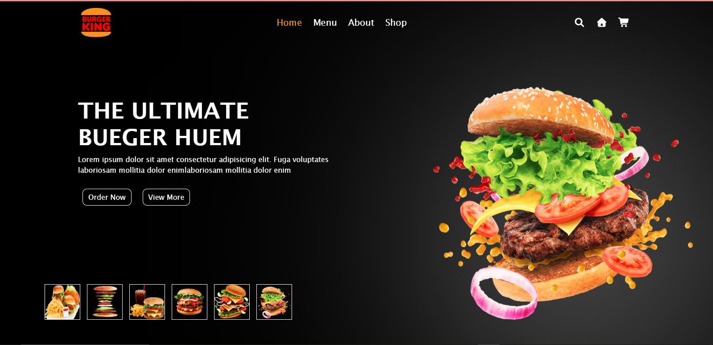

# 🍔 Restaurant

## 📌 Project Description

This is a simple animated project that generates random stars in the background of the browser window using HTML, CSS, and JavaScript. Upon loading the page, 100 stars are randomly placed throughout the screen.

---

## 🎯 Project Purpose

This mini-project demonstrates how to:
- Dynamically create HTML elements using JavaScript
- Work with the DOM (Document Object Model)
- Use random positioning and styling
- Apply basic CSS design for visual effects

---

## ⚙️ Technologies Used

- HTML
- CSS
- JavaScript (Vanilla) 
- Font Awesome (CDN)

---

## ✨ How It Works

1. When the page loads, the `createStars()` function runs.
2. The function creates 100 `<div>` elements with the class `star`.
3. Each star is randomly positioned across the screen (top and left).
4. All stars are appended to a container with the id `stars`.

---

## 🧪 project Structure

```
Restaurant/
├── index.html
├── css/
│   └── styles.css
├── images/
│   └── (all images used in the project)
├──myscript.js
└── README.md
```

## 🚀 How to Run the Project Locally

1. **Clone the Repository:**

```
git clone https://github.com/somayaataee/Restaurant.git
cd Restaurant
```

2. **Open the Project:**

You can open `index.html` directly in your browser or use a live server (like in VS Code).


## 📸 Screenshots




## ✍️ Author

**Somaya Ataie**  
[GitHub Profile](https://github.com/somayaataee)

## 📄 License

This project is open-source and free to use for educational purposes.

##  Deployed (Render)

[🔗 Open live demo — restaurant-ten-lime.vercel.app](https://restaurant-ten-lime.vercel.app/)


---
##👤 Developer
- 👩‍💻 Somaya Ataie
- 📍 Herat, Afghanistan
- 💻 junior FullStack Engineer

[https://github.com/somayaataee](https://github.com/somayaataee)


